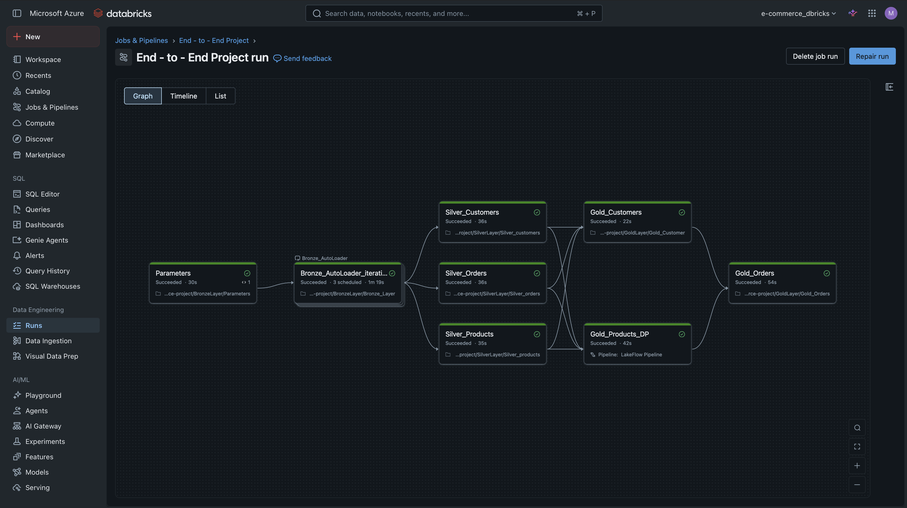

# 🚀 End-to-End Data Engineering Project on Azure Databricks

An end-to-end Data Engineering project built on **Azure Databricks** following the **Medallion Architecture (Bronze → Silver → Gold)**.

The project demonstrates scalable data ingestion using **Auto Loader** and **Structured Streaming**, data transformation with **PySpark**, and dimensional modeling using **Delta Lake** and **Lakeflow Declarative Pipelines (formerly Delta Live Tables)**.

---

# 📌 Project Architecture



---

# 🏗️ Architecture Overview

The project follows the Medallion Architecture:

```
Azure Data Lake Storage Gen2
            │
            ▼
      Bronze Layer
            │
            ▼
      Silver Layer
            │
            ▼
       Gold Layer
```

---

# 🥉 Bronze Layer

The Bronze layer is responsible for ingesting raw data from **Azure Data Lake Storage Gen2**.

### Features

- Auto Loader
- Structured Streaming
- Delta Lake
- Incremental Data Ingestion
- Scalable ingestion process

A dedicated **Parameters** notebook dynamically reads folder names from ADLS and executes the Bronze ingestion notebook in a loop using a Databricks Job.

Datasets ingested:

- Customers
- Products
- Orders

---

# 🥈 Silver Layer

The Silver layer performs data cleansing and transformations.

### Operations

- Data validation
- Column renaming
- Data type conversions
- Null handling
- Business transformations

The transformed data is stored as Delta tables.

---

# 🥇 Gold Layer

The Gold layer contains the analytical model built using a **Star Schema**.

## Dimension Tables

### Customers

- SCD Type 1
- Implemented manually using Delta MERGE

### Products

- SCD Type 2
- Implemented using Lakeflow Declarative Pipelines (DLT)

## Fact Table

Orders is implemented as the Fact table.

The pipeline enriches orders with surrogate keys from the dimension tables:

- DimCustomerKey
- DimProductKey

This creates a Star Schema optimized for analytical workloads.

---

# ⭐ Star Schema

```
                DimCustomers
                     │
                     │
                     │
DimProducts ─── FactOrders
```

---

# 🛠️ Technologies Used

- Azure Databricks
- PySpark
- Delta Lake
- Azure Data Lake Storage Gen2
- Unity Catalog
- Structured Streaming
- Auto Loader
- Lakeflow Declarative Pipelines (DLT)
- Delta MERGE
- Medallion Architecture
- Star Schema
- Slowly Changing Dimensions (SCD Type 1 & Type 2)

---

# 📂 Repository Structure

```
.
├── Bronze
│   ├── Parameters.ipynb
│   └── Bronze_Layer.ipynb
│
├── Silver
│   ├── Silver_customers.ipynb
│   ├── Silver_orders.ipynb
│   └── Silver_products.ipynb
│
├── Gold
│   ├── Gold_Customers.ipynb
│   ├── Gold_Orders.ipynb
│   └── Gold_Products_DLT.ipynb
│
├── Setup
│   └── creating_catalog_and_schema.ipynb
│
├── Images
│   └── pipeline.png
│
└── README.md
```

---

# 🔄 Pipeline Flow

```
ADLS Gen2
      │
      ▼
Auto Loader + Structured Streaming
      │
      ▼
Bronze Layer
      │
      ▼
Silver Layer
      │
      ▼
Gold Layer
      │
      ├── Customers (SCD Type 1)
      ├── Products (SCD Type 2)
      └── Fact Orders
```

---

# 📈 Key Concepts Demonstrated

- End-to-End Data Pipeline
- Medallion Architecture
- Incremental Data Processing
- Streaming Ingestion
- Delta Lake
- Slowly Changing Dimensions
- Star Schema
- Surrogate Keys
- ETL Pipeline Design
- Dimensional Modeling

---

# 👨‍💻 Author

**Murad Kamil**

LinkedIn: https://www.linkedin.com/in/murad-kamil/
